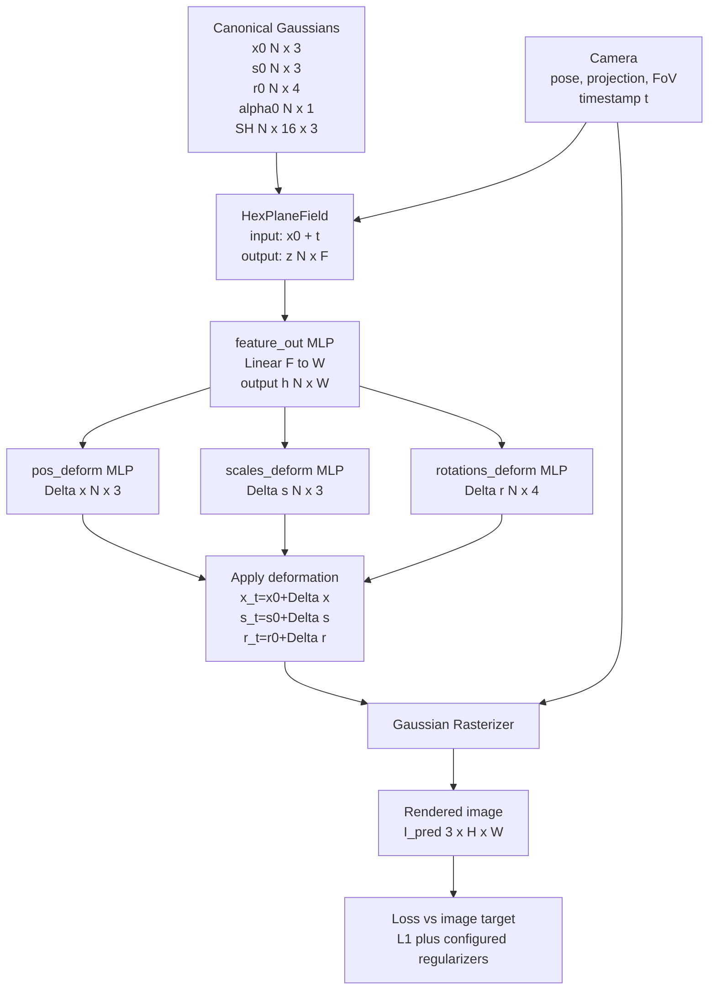

# Input-to-Output Architecture Flow for 4DGS, SDD-4DGS, and Our Motion-Mask Code

This document is a diagram-oriented architecture guide. It describes what enters the model, which module consumes it, what tensor shape comes out, and where the next module receives it.

Important scope note: the executable code inspected here implements 4DGS and our motion-mask modification. SDD-4DGS is not implemented as runnable code in this repository, so the SDD-4DGS section is written from the documented paper formulation only. It intentionally avoids unverified layer counts, hidden widths, or implementation-specific tensor dimensions.

## 0. What Is and Is Not an Input to the Network

There is no AlexNet, ResNet, CNN image encoder, or transformer in the 4DGS forward path in this repository.

The training image is used as supervision after rendering. It is not encoded into a feature tensor and fed into the deformation network.

The actual learnable scene representation is:

| Symbol | Code variable | Shape | Meaning |
|---|---|---:|---|
| `N` | `gaussians.get_xyz.shape[0]` | scalar | number of Gaussians, changes during densification |
| `x_0` | `GaussianModel._xyz` | `[N, 3]` | canonical 3D Gaussian center |
| `s_0` | `GaussianModel._scaling` | `[N, 3]` | raw log-scale parameters |
| `r_0` | `GaussianModel._rotation` | `[N, 4]` | raw quaternion parameters |
| `alpha_0` | `GaussianModel._opacity` | `[N, 1]` | raw opacity logits |
| `c_0` | `GaussianModel.get_features` | `[N, 16, 3]` when `sh_degree=3` | spherical harmonics color coefficients |
| `t` | `viewpoint_camera.time` expanded | `[N, 1]` | normalized timestamp for the current camera/image |
| `I_gt` | `viewpoint_cam.original_image` | `[3, H, W]` | ground-truth RGB image used only in the loss |

The forward model takes Gaussian attributes and camera/time, renders an image, and compares it with `I_gt`.

```text
Training image I_gt [3,H,W]
        |
        | used only after rendering
        v
Loss(rendered image, I_gt)

Canonical Gaussian table + timestamp + camera
        |
        v
Deformation network + Gaussian rasterizer
        |
        v
Rendered image [3,H,W]
```

## 1. Original 4DGS in This Codebase

Relevant files:

- `scene/gaussian_model.py`: stores canonical Gaussian parameters and deformation network.
- `scene/deformation.py`: defines `deform_network` and `Deformation`.
- `scene/hexplane.py`: defines the multi-resolution 4D HexPlane feature grid.
- `gaussian_renderer/__init__.py`: calls deformation and rasterization in `render(...)`.
- `train.py`: samples cameras, renders, computes losses, and updates parameters.

### 1.1 Dataset and Camera Input

The scene loader builds camera objects containing:

| Camera field | Shape / type | Used by |
|---|---:|---|
| image | `[3,H,W]` | loss target |
| camera pose / projection | matrices | Gaussian rasterizer |
| FoV / image size | scalars | rasterization settings |
| time | scalar | deformation network |

During training, `train.py::scene_reconstruction(...)` samples one or more cameras per iteration depending on `batch_size`.

For each selected camera:

```text
Camera:
  RGB image I_gt [3,H,W]
  camera extrinsics / intrinsics
  scalar timestamp t
```

The camera image is not passed through a CNN. It is used only after the rasterizer produces a predicted image.

### 1.2 Canonical Gaussian State

`GaussianModel` stores a table of learnable canonical Gaussians:

```text
GaussianModel
├── centers:      x_0      [N, 3]
├── scales:       s_0      [N, 3]
├── rotations:    r_0      [N, 4]
├── opacity:      alpha_0  [N, 1]
├── SH colors:    c_0      [N, 16, 3] for sh_degree=3
└── deformation:  deform_network(...)
```

`N` is not fixed. It starts from the initial point cloud and changes through densification and pruning.

### 1.3 Original 4DGS Forward Flow

At render time, `gaussian_renderer.render(...)` prepares:

```text
x_0       = pc.get_xyz       [N,3]
s_0       = pc._scaling      [N,3]
r_0       = pc._rotation     [N,4]
alpha_0   = pc._opacity      [N,1]
c_0       = pc.get_features  [N,16,3]
t         = camera.time repeated N times -> [N,1]
camera    = view/projection/raster settings
```

Then the fine-stage path calls:

```python
pc._deformation(x_0, s_0, r_0, alpha_0, c_0, t)
```

The original 4DGS deformation path is:

```text
x_0 [N,3] + t [N,1]
        |
        v
HexPlaneField
        |
        v
grid feature z [N,F]
        |
        v
feature_out MLP
        |
        v
hidden feature h [N,W]
        |
        +--------------------+--------------------+--------------------+
        |                    |                    |                    |
        v                    v                    v                    v
pos_deform MLP        scales_deform MLP    rotations_deform MLP  optional heads
Δx [N,3]              Δs [N,3]             Δr [N,4]             Δopacity, ΔSH
        |                    |                    |
        v                    v                    v
x_t = x_0 + Δx        s_t = s_0 + Δs       r_t = r_0 + Δr
        |
        v
Gaussian rasterizer with camera
        |
        v
rendered image I_pred [3,H,W], radii [N], depth
```

In the default configuration, opacity and SH deformation are disabled by `no_do=True` and `no_dshs=True`, although their MLP heads exist in `scene/deformation.py`.

### 1.4 HexPlane Feature Extraction

`HexPlaneField` receives raw 3D position and time:

```text
x_0 [N,3]
t   [N,1]
    |
    v
concat -> q = [x,y,z,t] [N,4]
```

For 4D input and 2D grids, the HexPlane uses all 2D coordinate pairs:

```text
(x,y), (x,z), (x,t), (y,z), (y,t), (z,t)
```

For each resolution level:

```text
sample 6 learned 2D planes
        |
        v
multiply the 6 sampled feature vectors
        |
        v
one feature vector [N,C]
```

Across multiple resolutions:

```text
concat all resolution-level features -> z [N, F]
F = C * number_of_multires_levels
```

Concrete configurations in this repo:

| Config | `output_coordinate_dim` C | `multires` | HexPlane output F | `net_width` W |
|---|---:|---:|---:|---:|
| D-NeRF default | 32 | `[1,2]` | 64 | 64 |
| HyperNeRF default | 16 | `[1,2,4]` | 48 | 128 |
| Custom M200 config | 32 | inherited `[1,2]` unless overridden | 64 | 64 |

### 1.5 MLP Head Shapes

In `scene/deformation.py`, the active deformation network is:

```text
z [N,F]
  |
  v
feature_out:
  Linear(F, W)
  plus extra ReLU/Linear(W,W) blocks when defor_depth adds them
  |
  v
h [N,W]
```

Then the heads are:

```text
pos_deform:
  ReLU -> Linear(W,W) -> ReLU -> Linear(W,3)
  output Δx [N,3]

scales_deform:
  ReLU -> Linear(W,W) -> ReLU -> Linear(W,3)
  output Δs [N,3]

rotations_deform:
  ReLU -> Linear(W,W) -> ReLU -> Linear(W,4)
  output Δr [N,4]

opacity_deform:
  ReLU -> Linear(W,W) -> ReLU -> Linear(W,1)
  output Δalpha [N,1]
  default disabled by no_do=True

shs_deform:
  ReLU -> Linear(W,W) -> ReLU -> Linear(W,48)
  reshaped to [N,16,3]
  default disabled by no_dshs=True
```

The class `deform_network` also defines a `timenet`, but in the inspected current forward path the `timenet` output is commented out and not used. Time enters the active model through the HexPlane coordinate `[x,y,z,t]`.

### 1.6 Rasterizer Output

After deformation, `gaussian_renderer.render(...)` applies activations:

```text
scale activation:    exp(s_t)
rotation activation: normalize(r_t)
opacity activation:  sigmoid(alpha_t)
```

Then the differentiable Gaussian rasterizer consumes:

```text
deformed centers      x_t       [N,3]
screen-space centers  means2D   [N,3]
SH colors             c_t       [N,16,3]
opacity               alpha_t   [N,1]
scales                exp(s_t)  [N,3]
rotations             norm(r_t) [N,4]
camera matrices
```

and returns:

```text
I_pred [3,H,W]
radii  [N]
depth
```

### 1.7 Original 4DGS Training Loss in This Code

In `train.py`, the main reconstruction loss is:

```text
L_recon = L1(I_pred, I_gt)
```

Additional configured terms may be added:

```text
L_time_grid = plane/time regularization from GaussianModel.compute_regulation(...)
L_ssim      = lambda_dssim * (1 - SSIM)
```

The LPIPS training block exists in comments and is not active in the inspected `train.py`. LPIPS is used by evaluation scripts, not by the default training forward path.

## 2. SDD-4DGS Paper-Level Structure

This section describes SDD-4DGS from the paper formulation, not from runnable code in this repository.

The key SDD idea is to add a dynamic perception coefficient to each Gaussian. In the paper notation, this coefficient is associated with a Bernoulli-style dynamic/static state.

### 2.1 SDD Conceptual Flow

```text
Canonical Gaussian i
  μ_0,i, Σ_0,i, color, opacity
        |
        v
4DGS-style deformation predicts dynamic changes
  Δμ_t,i, ΔΣ_t,i
        |
        v
dynamic perception coefficient
  w_i or p(f_i=1)
        |
        v
decoupled dynamic/static mixture
  μ'_t,i = μ_0,i + w_i Δμ_t,i
  Σ'_t,i = Σ_0,i + w_i ΔΣ_t,i
        |
        v
Gaussian rasterization
        |
        v
rendered image
```

### 2.2 SDD Formulation

The paper-level position/covariance formulation can be written as:

```math
\mu'_t = (1-w)\mu_0 + w\mu_t
       = \mu_0 + w\Delta\mu_t
```

```math
\Sigma'_t = \Sigma_0 + w\Delta\Sigma_t
```

The coefficient `w` represents the probability or strength of dynamic behavior. The paper describes a binary dynamic/static interpretation using a Bernoulli distribution:

```math
f \sim \mathcal{B}(w)
```

with an entropy-like regularization term:

```math
L_b = w \log w + (1-w)\log(1-w)
```

The intended effect is to push each Gaussian toward one dominant state: static or dynamic.

### 2.3 SDD Separation Output

After optimization, SDD separates Gaussians using thresholds:

```text
dynamic set: G_d = { Gaussian i | w_i > τ_d }
static set:  G_s = { Gaussian i | w_i < τ_s }
```

The paper formulation treats `w_i` as a per-Gaussian dynamic coefficient. The exact network implementation, tensor layout, and hidden dimensions are not verified in this repository because SDD-4DGS code is not present here.

## 3. Our Motion-Mask Code

Relevant code additions are in:

- `scene/deformation.py`: `motion_mask_deform`, mask prediction, and gated deformation.
- `scene/gaussian_model.py`: motion-mask losses, stats, and colored PLY export.
- `train.py`: adds motion losses and writes `motion_mask_stats.jsonl`.
- `arguments/__init__.py`: adds CLI flags.

### 3.1 What Our Motion Mask Is

Our motion mask is a learned scalar output per Gaussian per rendered timestamp:

```text
m_i(t) in (0,1)
```

Shape:

```text
m [N,1]
```

It is not a ground-truth mask. It is not produced by SAM, GroundingDINO, or any image segmentation model. It is predicted from the same hidden deformation feature `h [N,W]` used by the deformation MLP heads.

### 3.2 Where the Mask Branch Is Inserted

Original 4DGS has:

```text
HexPlane -> feature_out -> h [N,W] -> deformation heads
```

Our code inserts a new branch after `h`:

```text
HexPlane -> feature_out -> h [N,W]
                              |
                              +--> motion_mask_deform
                                      ReLU -> Linear(W,W) -> ReLU -> Linear(W,1)
                                      |
                                      v
                                  sigmoid
                                      |
                                      v
                                  m [N,1]
```

The full modified path is:

```text
x_0 [N,3] + t [N,1]
        |
        v
HexPlaneField
        |
        v
z [N,F]
        |
        v
feature_out MLP
        |
        v
h [N,W]
        |
        +------------------+---------------------+---------------------+----------------+
        |                  |                     |                     |
        v                  v                     v                     v
motion_mask_deform   pos_deform MLP       scales_deform MLP     rotations_deform MLP
logit [N,1]          Δx [N,3]              Δs [N,3]              Δr [N,4]
        |
        v
sigmoid
        |
        v
m [N,1]
```

### 3.3 Our Gated Deformation Equations

When `--motion-separation` is enabled, position deformation is gated:

```math
x_t = x_0 + m(t)\Delta x_t
```

In code:

```python
pts = rays_pts_emb[:, :3] + motion_mask * dx
```

When `--motion-gate-rot-scale` is also enabled, scale and rotation deformation are gated too:

```math
s_t = s_0 + m(t)\Delta s_t
```

```math
r_t = r_0 + m(t)\Delta r_t
```

In code:

```python
scales = scales_emb[:, :3] + motion_mask * ds
rotations = rotations_emb[:, :4] + motion_mask * dr
```

If `--motion-gate-rot-scale` is not enabled, scale and rotation follow the original deformation behavior while only position is motion-gated.

Opacity and SH color are not motion-gated by the new mask in the inspected implementation.

### 3.4 Our Loss Terms

The total training loss becomes:

```math
L =
L_\text{recon}
+ L_\text{grid}
+ \lambda_\text{ssim}L_\text{ssim}
+ \lambda_\text{sparse}L_\text{sparse}
+ \lambda_\text{bin}L_\text{bin}
+ \lambda_\text{static}L_\text{static}
```

where only enabled nonzero terms are applied.

The old prototype sparsity term is:

```math
L_\text{sparse} = \frac{1}{N}\sum_i m_i
```

Code:

```python
motion_mask.mean()
```

This term is controlled by `--motion-mask-lambda`. In the later experiments, this was usually set to `0`, so it did not affect training.

The binarization term is:

```math
L_\text{bin} = \frac{1}{N}\sum_i m_i(1-m_i)
```

Code:

```python
(motion_mask * (1.0 - motion_mask)).mean()
```

This encourages masks to move toward `0` or `1` instead of staying in the middle.

The static deformation penalty is:

```math
L_\text{static} =
\frac{1}{N}\sum_i (1-m_i)\|\Delta x_i\|_2
```

Code:

```python
((1.0 - motion_mask) * dx.norm(dim=-1, keepdim=True)).mean()
```

This discourages low-mask Gaussians from moving. It is important because otherwise the model can use a low mask together with a large `Δx` and still reconstruct the image.

### 3.5 Our Statistics and Debug Outputs

`GaussianModel.motion_mask_stats()` computes:

```text
mean                         = mean(m)
std                          = std(m)
dynamic_fraction             = fraction(m > 0.5)
static_fraction              = fraction(m <= 0.5)
fraction_gt_0_1              = fraction(m > 0.1)
fraction_gt_0_2              = fraction(m > 0.2)
fraction_gt_0_3              = fraction(m > 0.3)
fraction_gt_0_4              = fraction(m > 0.4)
dx_norm_mean                 = mean(||Δx||)
dx_norm_static_weighted_mean = mean((1-m)||Δx||)
```

During training, `train.py` writes these records every 100 iterations to:

```text
motion_mask_stats.jsonl
```

When saving a model, the code also writes:

```text
motion_mask_last.pt
motion_mask_colors.ply
```

The colored PLY uses:

```text
red  = m
blue = 1 - m
green = 0
```

So static-looking Gaussians are blue, dynamic-looking Gaussians are red, and intermediate soft values appear purple.

## 4. Side-by-Side Architecture Comparison

### 4.1 Original 4DGS

```text
Camera pose + timestamp t
Canonical Gaussians {x_0,s_0,r_0,alpha_0,c_0}
        |
        v
HexPlane(x_0,t) -> z [N,F]
        |
        v
feature_out -> h [N,W]
        |
        v
MLP heads -> Δx, Δs, Δr
        |
        v
x_t=x_0+Δx, s_t=s_0+Δs, r_t=r_0+Δr
        |
        v
Gaussian rasterizer
        |
        v
I_pred [3,H,W]
        |
        v
L1 / optional SSIM / grid regularization against I_gt
```

### 4.2 SDD-4DGS

```text
Camera pose + timestamp t
Canonical Gaussians {μ_0,Σ_0,color,opacity}
        |
        v
4DGS-style dynamic deformation -> Δμ_t, ΔΣ_t
        |
        v
dynamic coefficient w_i
        |
        v
μ'_t = μ_0 + w_i Δμ_t
Σ'_t = Σ_0 + w_i ΔΣ_t
        |
        v
Gaussian rasterizer
        |
        v
I_pred
        |
        v
reconstruction loss + entropy/binary regularization on w
        |
        v
threshold w to obtain static/dynamic Gaussian sets
```

### 4.3 Our Modified 4DGS

```text
Camera pose + timestamp t
Canonical Gaussians {x_0,s_0,r_0,alpha_0,c_0}
        |
        v
HexPlane(x_0,t) -> z [N,F]
        |
        v
feature_out -> h [N,W]
        |
        +-------------------------------+
        |                               |
        v                               v
motion_mask_deform -> sigmoid -> m      deformation heads -> Δx, Δs, Δr
        |                               |
        +---------------+---------------+
                        |
                        v
x_t = x_0 + m Δx
optional: s_t = s_0 + m Δs
optional: r_t = r_0 + m Δr
                        |
                        v
Gaussian rasterizer
                        |
                        v
I_pred [3,H,W]
                        |
                        v
L1 / grid regularization / optional SSIM
+ λ_bin mean(m(1-m))
+ λ_static mean((1-m)||Δx||)
```

## 5. Diagram-Ready Mermaid Blocks

### 5.1 Original 4DGS



### 5.2 SDD-4DGS

```mermaid
flowchart TD
    A[Canonical Gaussian<br/>mu0, Sigma0, color, opacity]
    B[Timestamp and camera]
    C[4DGS-style deformation<br/>Delta mu_t, Delta Sigma_t]
    D[Dynamic coefficient<br/>w_i or p(f_i=1)]
    E[Decoupled deformation<br/>mu'_t = mu0 + w_i Delta mu_t<br/>Sigma'_t = Sigma0 + w_i Delta Sigma_t]
    F[Gaussian Rasterizer]
    G[Rendered image]
    H[Reconstruction loss<br/>+ entropy/binary regularization on w]
    I[Threshold w<br/>dynamic/static Gaussian sets]
    A --> C
    B --> C
    C --> E
    D --> E
    E --> F
    B --> F
    F --> G
    G --> H
    D --> H
    D --> I
```

### 5.3 Our Motion-Mask 4DGS

```mermaid
flowchart TD
    A[Canonical Gaussians<br/>x0, s0, r0, alpha0, SH]
    B[Camera + timestamp t]
    C[HexPlaneField<br/>z N x F]
    D[feature_out MLP<br/>h N x W]
    M[motion_mask_deform<br/>Linear head + sigmoid<br/>m N x 1]
    E1[pos_deform<br/>Delta x N x 3]
    E2[scales_deform<br/>Delta s N x 3]
    E3[rotations_deform<br/>Delta r N x 4]
    F[Gated deformation<br/>x_t=x0+m Delta x<br/>optional s_t=s0+m Delta s<br/>optional r_t=r0+m Delta r]
    G[Gaussian Rasterizer]
    H[Rendered image I_pred]
    I[Training loss<br/>L1/grid/SSIM<br/>+ lambda_bin m(1-m)<br/>+ lambda_static (1-m)||Delta x||]
    J[Debug outputs<br/>motion_mask_stats.jsonl<br/>motion_mask_colors.ply]
    A --> C
    B --> C
    C --> D
    D --> M
    D --> E1
    D --> E2
    D --> E3
    M --> F
    E1 --> F
    E2 --> F
    E3 --> F
    F --> G
    B --> G
    G --> H
    H --> I
    M --> I
    M --> J
```

## 6. Key Differences for a Figure Caption

Original 4DGS:

```text
The deformation network predicts continuous offsets for all Gaussians from a HexPlane feature conditioned on position and time. It does not explicitly decide which Gaussians are static or dynamic.
```

SDD-4DGS:

```text
The model introduces a per-Gaussian dynamic coefficient w and uses it to blend static canonical attributes with dynamic deformed attributes. A binary/entropy regularizer and thresholds are used to separate static and dynamic Gaussian sets.
```

Our code:

```text
The model adds a lightweight motion-mask head to the existing 4DGS deformation hidden feature. The predicted soft mask gates deformation magnitude, especially position displacement, and optionally scale/rotation displacement. Additional losses encourage binarization and discourage deformation when the mask is low.
```

## 7. Important Correctness Notes

1. The model does not consume image tensors through AlexNet, ResNet, VGG, or any transformer. VGG/AlexNet appear only in LPIPS evaluation or optional loss utilities, not in the 4DGS scene representation forward path.

2. The active deformation time conditioning comes from HexPlane input coordinates `[x,y,z,t]`. The `timenet` module exists in `scene/deformation.py`, but its output is commented out in the inspected forward path.

3. Our mask `m` is predicted per Gaussian and per timestamp from the deformation hidden feature. It is not a fixed ground-truth label and not an external segmentation mask.

4. Our current default experiments use `--motion-gate-rot-scale` when we want scale and rotation deformation gated. Without this flag, only position deformation is gated.

5. `dynamic_fraction = fraction(m > 0.5)` is only a diagnostic threshold. It is not the training objective and can underestimate soft-but-visible motion separation when moving regions have mask values below 0.5.

6. SDD-4DGS details in this file are paper-level. Since the SDD implementation is not present in this repo, this document does not claim exact SDD code modules, tensor dimensions, or MLP architecture.
