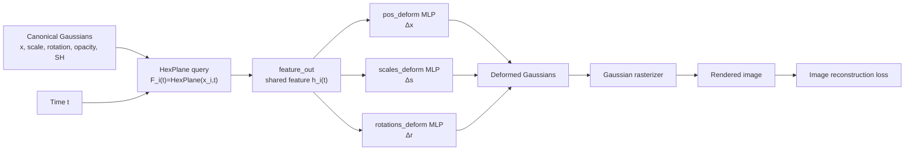
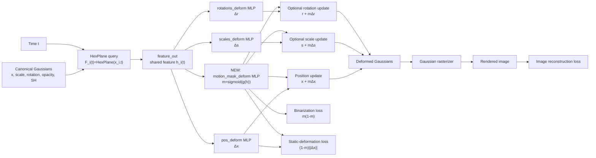

# Motion Mask Regularization for 4D Gaussian Splatting

## Reader's Guide

This report is written for a reader who may not know the details of 4D Gaussian Splatting or this codebase. It first explains the original 4DGS pipeline in plain language, then shows exactly where the motion mask was inserted, and finally summarizes the experiments.

One important clarification:

- there was an **early prototype** that used a sparsity-style mask loss,
- but that sparsity term turned out not to be useful,
- so the **final method** in this project is the regularized version with **binarization loss** and **static-deformation loss**.

This distinction matters for understanding the final results.

## 1. Introduction

### 1.1 Static 3D Reconstruction vs Dynamic 4D Reconstruction

Static 3D reconstruction tries to recover scene geometry and appearance from images under the assumption that the scene does not change.

Dynamic reconstruction is harder because the scene changes over time. A useful dynamic representation must explain:

1. what the scene looks like in 3D, and
2. how parts of the scene move over time.

This is why dynamic scene reconstruction is often called **4D reconstruction**: 3D space plus time.

### 1.2 NeRF, 3DGS, and 4DGS

NeRF represents a scene as a neural function and renders it by integrating samples along rays. It is flexible but can be slow.

3D Gaussian Splatting (3DGS) uses explicit Gaussian ellipsoids instead of dense volume samples. Each Gaussian has:

- a 3D position,
- a scale,
- a rotation,
- an opacity,
- color features.

Rendering is done by projecting the Gaussians into the image plane and splatting them.

4D Gaussian Splatting (4DGS) extends this idea to dynamic scenes. It stores Gaussians in a **canonical space** and uses a deformation network to move them over time.

### 1.3 Motivation

Original 4DGS can reconstruct dynamic scenes well, but it does not explicitly tell us which Gaussians are static and which are dynamic. The deformation network can move Gaussians as needed to reduce image loss, even if some of those Gaussians ideally should remain static.

The goal of this project is therefore:

> add a motion-aware signal to the 4DGS deformation pipeline so that the model knows how strongly each Gaussian should participate in time-dependent deformation.

### 1.4 Initial Segmentation-Based Direction

At first, a different idea was considered: using GroundingDINO + SAM2 masks with an Instant-NGP-style 3D reconstruction pipeline.

That direction was not chosen as the final project method because:

- it depends on external segmentation,
- segmentation masks may be inconsistent across time,
- semantic masks are not necessarily motion-aware,
- the segmentation stage is outside end-to-end 4DGS training.

The final method instead learns a latent motion coefficient directly inside the 4DGS deformation network.

## 2. Variable Glossary

To make the equations easier to read, here is a glossary.

| Symbol | Code variable | Meaning |
|---|---|---|
| $i$ | point index | Gaussian index |
| $t$ | `time`, `times_sel`, `time_emb` | timestamp for the current frame/view |
| $x_i^0$ or $\mu_i^0$ | `pc.get_xyz`, `means3D`, `rays_pts_emb[:, :3]` | canonical Gaussian position |
| $s_i^0$ | `pc._scaling`, `scales_emb[:, :3]` | canonical Gaussian scale |
| $r_i^0$ | `pc._rotation`, `rotations_emb[:, :4]` | canonical Gaussian rotation |
| $\Delta x_i(t)$ | `dx` | position deformation predicted by the network |
| $\Delta s_i(t)$ | `ds` | scale deformation predicted by the network |
| $\Delta r_i(t)$ | `dr` | rotation deformation predicted by the network |
| $F_i(t)$ | `grid_feature` | HexPlane spatiotemporal feature queried at Gaussian $i$ and time $t$ |
| $h_i(t)$ | `hidden` | shared feature after `feature_out` |
| $m_i(t)$ | `motion_mask` | predicted scalar soft motion mask |
| $\hat{I}$ | `image_tensor` | rendered image |
| $I$ | `gt_image_tensor` | ground-truth image |

The most important new variable is:

$$
m_i(t) = \sigma(g_\phi(h_i(t))).
$$

This means:

- compute a shared deformation feature $h_i(t)$,
- pass it into a new mask head $g_\phi$,
- apply sigmoid to get a number in $[0,1]$.

## 3. What Original 4DGS Does in This Codebase

This section explains the original 4DGS pipeline before our modification.

### 3.1 Gaussian Parameters

In `scene/gaussian_model.py`, each Gaussian stores:

- `_xyz`: canonical position,
- `_scaling`: scale,
- `_rotation`: rotation,
- `_opacity`: opacity,
- `_features_dc`, `_features_rest`: color features,
- `_deformation`: deformation network.

### 3.2 Coarse Stage and Fine Stage

During rendering, there are two stages:

1. **Coarse stage**: render canonical Gaussians directly.
2. **Fine stage**: deform the Gaussians using the deformation network, then render them.

In `gaussian_renderer/__init__.py`:

```python
if "coarse" in stage:
    means3D_final, scales_final, rotations_final, opacity_final, shs_final = means3D, scales, rotations, opacity, shs
elif "fine" in stage:
    means3D_final, scales_final, rotations_final, opacity_final, shs_final = pc._deformation(
        means3D, scales, rotations, opacity, shs, time
    )
```

So all dynamic behavior happens in the fine stage.

### 3.3 HexPlane Feature Query

The deformation network in `scene/deformation.py` first queries a HexPlane field:

```python
grid_feature = self.grid(rays_pts_emb[:, :3], time_emb[:, :1])
```

This gives a spatiotemporal feature:

$$
F_i(t) = \text{HexPlane}(x_i^0, t).
$$

### 3.4 What Exactly Is `hidden`?

This is one of the most important implementation details.

After querying the HexPlane feature, the code computes:

```python
hidden = torch.cat([grid_feature], -1)
hidden = self.feature_out(hidden)
```

This `hidden` variable is the **shared deformation feature** used by all later heads. It is not a Transformer feature. It is the output of `feature_out`, which is defined in `Deformation.create_net()`.

For the D-NeRF experiments in this project, the configuration is:

```python
defor_depth = 0
net_width = 64
```

That means `feature_out` is essentially just one linear layer from the HexPlane feature dimension to 64 dimensions. So:

$$
h_i(t) \in \mathbb{R}^{64}.
$$

This is exactly the feature from which both the deformation heads and the new motion-mask head are predicted.

### 3.5 Original Deformation Heads

The original code predicts deformation deltas using separate MLP heads:

```python
dx = self.pos_deform(hidden)
ds = self.scales_deform(hidden)
dr = self.rotations_deform(hidden)
```

So in simplified notation, original 4DGS does:

$$
x_i(t) = x_i^0 + \Delta x_i(t),
$$

$$
s_i(t) = s_i^0 + \Delta s_i(t),
$$

$$
r_i(t) = r_i^0 + \Delta r_i(t).
$$

### 3.6 Original 4DGS Diagram



## 4. What We Added

### 4.1 Exact Insertion Point

We add the motion mask **after `hidden` is computed** and **before deformation is applied**.

In `scene/deformation.py`, the key lines are:

```python
hidden = self.query_time(...)
motion_mask = torch.sigmoid(self.motion_mask_deform(hidden))
dx = self.pos_deform(hidden)
pts = rays_pts_emb[:, :3] + motion_mask * dx
```

So the main change is:

Original:

$$
x_i(t) = x_i^0 + \Delta x_i(t)
$$

Modified:

$$
x_i(t) = x_i^0 + m_i(t)\Delta x_i(t)
$$

### 4.2 The New Motion-Mask Head

The new head is:

```python
self.motion_mask_deform = nn.Sequential(
    nn.ReLU(),
    nn.Linear(self.W, self.W),
    nn.ReLU(),
    nn.Linear(self.W, 1)
)
```

It takes `hidden` as input and outputs one scalar logit. Sigmoid converts it to a soft mask:

$$
m_i(t) \in [0,1].
$$

Interpretation:

- small $m_i(t)$: this Gaussian should deform less,
- large $m_i(t)$: this Gaussian can deform more.

### 4.3 Optional Scale/Rotation Gating

By default, the mask gates only position. If the user enables:

```bash
--motion-gate-rot-scale
```

then scale and rotation are also gated:

$$
s_i(t) = s_i^0 + m_i(t)\Delta s_i(t),
$$

$$
r_i(t) = r_i^0 + m_i(t)\Delta r_i(t).
$$

This is implemented in the `if self.args.motion_separation and self.args.motion_gate_rot_scale` branches in `scene/deformation.py`.

### 4.4 Our Modified 4DGS Diagram



## 5. Early Prototype vs Final Method

This distinction is important.

### 5.1 Early Prototype

The earliest motion-mask attempt used a sparsity-style loss:

$$
\mathcal{L}_{\text{sparse}} = \operatorname{mean}(m).
$$

This was controlled by:

```bash
--motion-mask-lambda
```

This loss encouraged masks to become small, but in practice it often pushed the model toward all-static collapse. It was therefore **not retained as part of the final method**.

### 5.2 Final Method

The final method used in the main experiments sets:

```bash
--motion-mask-lambda 0
```

and instead uses:

1. **Binarization loss**

$$
\mathcal{L}_{\text{bin}} = \operatorname{mean}(m(1-m))
$$

2. **Static-deformation loss**

$$
\mathcal{L}_{\text{static-def}} = \operatorname{mean}((1-m)\|\Delta x\|_2)
$$

So the final objective used in the main experiments is:

$$
\mathcal{L}_{\text{final}}
=
\mathcal{L}_{\text{img}}
+ \mathcal{L}_{\text{grid}}
+ \lambda_{\text{bin}}\mathcal{L}_{\text{bin}}
+ \lambda_{\text{static}}\mathcal{L}_{\text{static-def}}.
$$

## 6. Experiments

### 6.1 Main Experimental Scenes

The main scenes used to evaluate the **final method** are:

- Bouncingballs
- Jumpingjacks

Lego was only used in early pilot experiments before the final regularized formulation was established.

### 6.2 Early Pilot Observation on Lego

The early prototype did not show meaningful gains on Lego. Since Lego contains only a small and slow moving region, it was not a strong scene for validating the final regularized motion-mask method. Therefore, Lego is not used as the main result scene in this report.

### 6.3 Bouncingballs Results

Verified reconstruction metrics:

| Method | SSIM ↑ | PSNR ↑ | LPIPS-vgg ↓ | LPIPS-alex ↓ | MS-SSIM ↑ | D-SSIM ↓ |
|---|---:|---:|---:|---:|---:|---:|
| Baseline | 0.9942868 | 40.6763 | 0.0153625 | 0.0060306 | 0.9953953 | 0.0023024 |
| Final regularized method (`static=1e-3`, `bin=1e-3`) | **0.9945415** | **40.8666** | **0.0143814** | **0.0056324** | **0.9955825** | **0.0022088** |
| Over-regularized variant (`static=1e-2`, `bin=1e-3`) | 0.9942789 | 40.7233 | 0.0155924 | 0.0059685 | 0.9953101 | 0.0023450 |

Interpretation:

- The final regularized method improves all reconstruction metrics over baseline.
- The improvement is modest, but it is consistent.
- Too strong a static-deformation loss causes a worse mask and slightly worse reconstruction.

Mask diagnostics:

| Method | mean | std | dynamic fraction | fraction > 0.4 | Qualitative mask |
|---|---:|---:|---:|---:|---|
| Early no-sparsity mask | 0.2475 | 0.0641 | 0.0001 | not logged | nearly uniform soft mask |
| Final regularized method | 0.1851 | 0.1904 | 0.0117 | 0.2162 | moving balls show purple regions |
| Over-regularized variant | 0.9986 | 0.0022 | 1.0000 | 1.0000 | all red / all dynamic |

This shows that the final method gives a more structured soft mask than the early prototype.

### 6.4 Jumpingjacks Results

Verified reconstruction metrics:

| Method | SSIM ↑ | PSNR ↑ | LPIPS-vgg ↓ | LPIPS-alex ↓ | MS-SSIM ↑ | D-SSIM ↓ |
|---|---:|---:|---:|---:|---:|---:|
| Baseline | 0.9855952 | 35.4000 | 0.0199500 | 0.0126626 | 0.9936216 | 0.0031892 |
| Final regularized method (`static=1e-3`, `bin=1e-3`) | **0.9863845** | **35.5784** | **0.0189655** | **0.0123328** | **0.9940146** | **0.0029927** |

Interpretation:

- On Jumpingjacks, the same final regularized method again improves all reported reconstruction metrics.
- This suggests that the method is more helpful on scenes with stronger motion.

## 7. Discussion

### 7.1 What Helps

The final motion-mask method helps in two ways:

1. It gives a motion-aware soft localization signal.
2. On strongly dynamic scenes, it can slightly improve reconstruction quality.

### 7.2 What Fails

The main failure modes are:

- **all-static collapse** in the early sparsity-based prototype,
- **all-dynamic collapse** when `static_deform_lambda` is too large,
- **soft ambiguity** when the mask stays in the middle range.

### 7.3 Why Similar Renders Can Hide Very Different Masks

Two models can render almost the same image but learn very different masks. That is because the rendered result depends on the final deformed Gaussian positions, not directly on the mask itself.

For example:

$$
x_t = x_0 + m\Delta x
$$

can be similar for:

$$
m=1,\ \Delta x = a
$$

and:

$$
m=0.2,\ \Delta x = 5a.
$$

So mask quality must be evaluated separately from image quality.

## 8. Conclusion

This project adds a motion-aware soft mask to an existing 4D Gaussian Splatting codebase. The mask is inserted inside the deformation network after the shared feature `hidden` is computed and before deformation is applied.

The final method is **not** the early sparsity-only prototype. The final method uses:

- motion-mask gating,
- optional scale/rotation gating,
- binarization loss,
- static-deformation loss.

On Bouncingballs and Jumpingjacks, this final regularized formulation yields modest but consistent reconstruction gains and more meaningful soft motion localization than the early prototype. However, it still produces a soft mask rather than a robust binary static/dynamic decomposition.
