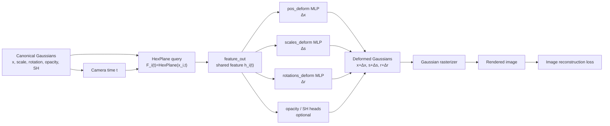
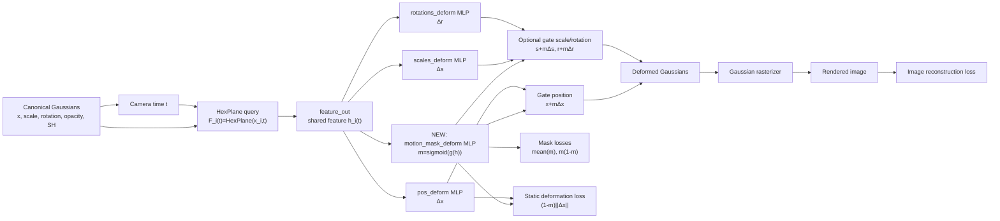

# Motion Mask Regularization for 4D Gaussian Splatting

## Reader's Guide

This report is written for a reader who knows the high-level idea of 3D reconstruction but may not know the details of this codebase. The report first explains the original 4DGS pipeline, then identifies the exact location where the motion mask was added.

The key implementation files are:

- `gaussian_renderer/__init__.py`: calls the deformation network during rendering.
- `scene/deformation.py`: defines the HexPlane feature query, deformation heads, and the added motion-mask head.
- `scene/gaussian_model.py`: stores Gaussian parameters and exposes mask losses/statistics.
- `train.py`: computes image loss and optional motion-mask regularizers.
- `arguments/__init__.py`: defines command-line flags.

## 1. Introduction

### 1.1 From 3D Reconstruction to 4D Reconstruction

Static 3D reconstruction tries to recover a scene geometry and appearance from multiple images. A static method assumes that the scene does not change while cameras move around it.

Dynamic reconstruction is harder. The scene now changes with time, so the representation must explain both:

1. the 3D structure of the scene, and
2. how that structure moves or deforms over time.

This is often called **4D reconstruction**, where the fourth dimension is time.

### 1.2 NeRF, 3DGS, and 4DGS

NeRF represents a scene as a neural field. Given a 3D point and viewing direction, the network predicts density and color. Rendering is done by sampling many points along camera rays.

3D Gaussian Splatting (3DGS) replaces dense ray sampling with an explicit set of anisotropic Gaussian ellipsoids. Each Gaussian has parameters such as position, scale, rotation, opacity, and color features. Rendering projects these Gaussians into the image plane and alpha-composites them.

4D Gaussian Splatting (4DGS) extends 3DGS to dynamic scenes. It keeps Gaussians in a canonical space and uses a deformation network to map them to time-dependent Gaussians before rendering.

In simplified notation:

$$
G_i^0 = (\mu_i^0, s_i^0, r_i^0, \alpha_i, c_i)
$$

is the canonical Gaussian at index $i$, where:

- $\mu_i^0 \in \mathbb{R}^3$: canonical 3D position.
- $s_i^0 \in \mathbb{R}^3$: canonical scale.
- $r_i^0 \in \mathbb{R}^4$: canonical rotation quaternion.
- $\alpha_i$: opacity.
- $c_i$: spherical harmonics color features.

At time $t$, 4DGS predicts deformation deltas:

$$
\Delta \mu_i(t), \quad \Delta s_i(t), \quad \Delta r_i(t).
$$

The deformed Gaussian is then rendered:

$$
\mu_i(t) = \mu_i^0 + \Delta \mu_i(t).
$$

### 1.3 Motivation

Original 4DGS can reconstruct dynamic scenes, but it does not explicitly say which Gaussians are static and which are dynamic. The deformation network may move many Gaussians in order to minimize image reconstruction loss, even if only part of the scene actually moves.

The goal of this project is to add a **motion-aware mask** into the 4DGS deformation pipeline. This mask is intended to indicate how much each Gaussian participates in time-dependent deformation.

### 1.4 Initial Segmentation-Based Attempt

An earlier direction considered using GroundingDINO and SAM2 masks with an Instant-NGP-style 3D reconstruction pipeline. That direction was not used as the final method because:

- it depends on external segmentation quality,
- masks can be inconsistent across time,
- prompts may not correspond to actual motion,
- segmentation is not integrated into differentiable 4DGS training,
- it is object-aware but not necessarily motion-aware.

The final method instead learns a latent motion response directly inside the 4DGS deformation network.

## 2. Variable Glossary

This table defines the main variables used in this report.

| Symbol | Code variable | Meaning |
|---|---|---|
| $i$ | point index | Gaussian index |
| $t$ | `time`, `times_sel`, `time_emb` | normalized timestamp for the current camera/view |
| $\mu_i^0$ or $x_i^0$ | `pc.get_xyz`, `means3D`, `rays_pts_emb[:, :3]` | canonical Gaussian position |
| $s_i^0$ | `pc._scaling`, `scales_emb[:, :3]` | canonical Gaussian scale parameter |
| $r_i^0$ | `pc._rotation`, `rotations_emb[:, :4]` | canonical Gaussian rotation parameter |
| $\Delta x_i(t)$ | `dx` | predicted position deformation |
| $\Delta s_i(t)$ | `ds` | predicted scale deformation |
| $\Delta r_i(t)$ | `dr` | predicted rotation deformation |
| $F_i(t)$ | `grid_feature` | HexPlane spatiotemporal feature queried at $(x_i^0,t)$ |
| $h_i(t)$ | `hidden` | shared deformation feature after `feature_out` |
| $m_i(t)$ | `motion_mask` | predicted scalar soft motion mask in $[0,1]$ |
| $\hat{I}$ | `image_tensor` | rendered image |
| $I$ | `gt_image_tensor` | ground-truth training image |

The most important variable is:

$$
m_i(t) = \sigma(g_\phi(h_i(t))),
$$

where:

- $\sigma$ is sigmoid,
- $g_\phi$ is the new motion-mask MLP head,
- $h_i(t)$ is the shared feature produced by the original deformation network.

## 3. Related Work

### 3.1 Original 4D Gaussian Splatting

Original 4DGS represents dynamics using a deformation field. Instead of storing a separate Gaussian cloud for every frame, it stores canonical Gaussians and predicts how they deform at time $t$.

This codebase implements that idea using:

1. a HexPlane feature field,
2. a shared feature projection MLP called `feature_out`,
3. separate deformation heads for position, scale, rotation, opacity, and SH features,
4. a differentiable Gaussian rasterizer.

The dynamic behavior is implicit: the model predicts deformation deltas but does not produce an explicit static/dynamic label.

### 3.2 SDD-4DGS

SDD-4DGS proposes a static-dynamic decoupling framework. Based on the paper title, public summary, and the provided excerpt, SDD introduces a dynamic perception coefficient associated with Gaussian ellipsoids. Conceptually, that coefficient gates time-dependent deformation:

$$
\mu'_t = \mu_0 + w \Delta \mu_t.
$$

It further treats the coefficient probabilistically and encourages Gaussians to take either a static or dynamic state.

Our method is related to this idea, but it is not a reproduction of SDD-4DGS. The main difference is:

- SDD: coefficient is described as a per-Gaussian dynamic coefficient.
- Ours: coefficient is predicted by a network head from the deformation feature.

Thus our mask is a soft motion response:

$$
m_i(t) = \sigma(g_\phi(h_i(t))),
$$

not a stored per-Gaussian Bernoulli parameter.

### 3.3 Mask-Based and Segmentation-Based Methods

Mask-based NeRF or 3D reconstruction methods often use external segmentation masks. Those masks can separate objects, but they require external supervision and may not be temporally consistent.

Our method does not use GroundingDINO, SAM2, optical flow labels, or ground-truth dynamic masks during training. It learns a latent mask from reconstruction and regularization.

## 4. Original 4DGS Pipeline in This Codebase

This section explains the original pipeline before our modification.

### 4.1 Gaussian Parameters

In `scene/gaussian_model.py`, each Gaussian has learnable parameters:

- `_xyz`: canonical 3D position,
- `_scaling`: scale,
- `_rotation`: rotation,
- `_opacity`: opacity,
- `_features_dc`, `_features_rest`: spherical harmonics color features,
- `_deformation`: deformation network.

During rendering, `gaussian_renderer/__init__.py` first reads these canonical parameters:

```python
means3D = pc.get_xyz
opacity = pc._opacity
shs = pc.get_features
scales = pc._scaling
rotations = pc._rotation
```

### 4.2 Coarse Stage vs Fine Stage

The renderer has two stages:

1. **Coarse stage:** render canonical Gaussians directly.
2. **Fine stage:** send Gaussians through the deformation network before rendering.

In code:

```python
if "coarse" in stage:
    means3D_final, scales_final, rotations_final, opacity_final, shs_final = means3D, scales, rotations, opacity, shs
elif "fine" in stage:
    means3D_final, scales_final, rotations_final, opacity_final, shs_final = pc._deformation(
        means3D, scales, rotations, opacity, shs, time
    )
```

So the motion model is used in the fine stage.

### 4.3 The Deformation Network

The deformation network is defined in `scene/deformation.py`.

The wrapper class is:

```python
class deform_network(nn.Module):
```

It calls:

```python
self.deformation_net = Deformation(...)
```

The actual deformation logic is inside:

```python
class Deformation(nn.Module):
```

### 4.4 HexPlane Feature Query

For each Gaussian and timestamp, the network queries a HexPlane feature field:

```python
grid_feature = self.grid(rays_pts_emb[:, :3], time_emb[:, :1])
```

This returns a spatiotemporal feature:

$$
F_i(t) = \operatorname{HexPlane}(x_i^0,t).
$$

For the D-NeRF configuration used here:

- `multires = [1, 2]`,
- `output_coordinate_dim = 32`,
- features are concatenated across the two resolutions,
- so the printed feature dimension is 64.

Thus, in typical D-NeRF runs:

$$
F_i(t) \in \mathbb{R}^{64}.
$$

### 4.5 What Exactly Is `hidden`?

In the report formula:

$$
h_i(t) = \operatorname{feature\_out}(F_i(t)).
$$

This is exactly the variable named `hidden` in `scene/deformation.py`:

```python
hidden = torch.cat([grid_feature], -1)
hidden = self.feature_out(hidden)
```

The module `feature_out` is built in `Deformation.create_net()`:

```python
self.feature_out = [nn.Linear(grid_out_dim, self.W)]
for i in range(self.D - 1):
    self.feature_out.append(nn.ReLU())
    self.feature_out.append(nn.Linear(self.W, self.W))
self.feature_out = nn.Sequential(*self.feature_out)
```

In the D-NeRF default config:

```python
defor_depth = 0
net_width = 64
```

Therefore, for the runs discussed here, `feature_out` is effectively a single linear projection from the HexPlane feature dimension to a 64-dimensional shared feature. There are no extra trunk hidden layers added by the `for i in range(self.D - 1)` loop under this configuration.

This means:

$$
h_i(t) \in \mathbb{R}^{64}.
$$

It is not a Transformer feature. It is the shared deformation feature produced after HexPlane feature lookup and `feature_out`.

### 4.6 Original Deformation Heads

After computing `hidden`, original 4DGS predicts separate deformation outputs:

```python
dx = self.pos_deform(hidden)
ds = self.scales_deform(hidden)
dr = self.rotations_deform(hidden)
do = self.opacity_deform(hidden)
dshs = self.shs_deform(hidden)
```

The heads are small MLPs. For example, the position head is:

```python
self.pos_deform = nn.Sequential(
    nn.ReLU(),
    nn.Linear(self.W, self.W),
    nn.ReLU(),
    nn.Linear(self.W, 3)
)
```

So the baseline fine-stage position update is:

$$
x_i(t) = x_i^0 + \Delta x_i(t).
$$

In code, without motion separation:

```python
pts = rays_pts_emb[:, :3] * mask + dx
```

In the common configuration, `mask` is a legacy mask that becomes all ones unless `static_mlp` or `empty_voxel` is enabled. Therefore this is effectively:

$$
x_i(t) = x_i^0 + \Delta x_i(t).
$$

### 4.7 Original 4DGS Diagram



## 5. Our Motion-Mask Modification

### 5.1 Where We Add the New Component

We add the motion mask **after** the shared deformation feature `hidden` is computed and **before** deformation deltas are applied.

In `scene/deformation.py`, the original pipeline already has:

```python
hidden = self.query_time(...)
dx = self.pos_deform(hidden)
```

We insert:

```python
motion_mask = torch.sigmoid(self.motion_mask_deform(hidden))
```

The new mask head is created only when:

```bash
--motion-separation
```

is enabled.

### 5.2 Motion-Mask Head

The new head is:

```python
self.motion_mask_deform = nn.Sequential(
    nn.ReLU(),
    nn.Linear(self.W, self.W),
    nn.ReLU(),
    nn.Linear(self.W, 1)
)
```

It takes the same `hidden` feature as the deformation heads and outputs one scalar logit. Sigmoid maps this logit to a soft mask:

$$
m_i(t) \in [0,1].
$$

Interpretation:

- $m_i(t) \approx 0$: Gaussian is treated as mostly static for this forward pass.
- $m_i(t) \approx 1$: Gaussian is allowed to fully participate in deformation.
- middle values: soft participation.

It is important that this is **not** a ground-truth binary label.

### 5.3 How the Mask Changes the Deformation

Original position update:

$$
x_i(t) = x_i^0 + \Delta x_i(t).
$$

Our masked update:

$$
x_i(t) = x_i^0 + m_i(t)\Delta x_i(t).
$$

In code:

```python
if self.args.motion_separation:
    pts = rays_pts_emb[:, :3] + motion_mask * dx
```

So the exact insertion point is the multiplication:

```python
motion_mask * dx
```

This is the main change.

### 5.4 Optional Scale and Rotation Gating

Originally, our first motion-separation version only gated position. Later, we added the flag:

```bash
--motion-gate-rot-scale
```

When this flag is enabled:

$$
s_i(t) = s_i^0 + m_i(t)\Delta s_i(t),
$$

$$
r_i(t) = r_i^0 + m_i(t)\Delta r_i(t).
$$

In code:

```python
if self.args.motion_separation and self.args.motion_gate_rot_scale:
    scales = scales_emb[:, :3] + motion_mask * ds
```

and:

```python
if self.args.motion_separation and self.args.motion_gate_rot_scale:
    rotations = rotations_emb[:, :4] + motion_mask * dr
```

Without this flag, scale and rotation can still deform without the motion mask. This is why the fixed experiments use `--motion-gate-rot-scale`.

### 5.5 What the Mask Does Not Do

The motion mask does **not**:

- directly gate opacity,
- directly gate color,
- use GroundingDINO or SAM2,
- use ground-truth static/dynamic labels,
- create separate static and dynamic Gaussian sets during training,
- become a hard binary variable during forward rendering.

It is a soft deformation gate.

### 5.6 Our Modified 4DGS Diagram



## 6. Losses

### 6.1 Original Reconstruction Loss

The training loop in `train.py` computes:

```python
Ll1 = l1_loss(image_tensor, gt_image_tensor[:, :3, :, :])
loss = Ll1
```

In math:

$$
\mathcal{L}_{\text{img}} = \|\hat{I} - I\|_1.
$$

During the fine stage, the original 4DGS grid regularization is also added:

```python
tv_loss = gaussians.compute_regulation(...)
loss += tv_loss
```

### 6.2 Original Motion-Mask Sparsity Loss

The first motion-mask version added:

$$
\mathcal{L}_{\text{mask}} = \operatorname{mean}(m).
$$

In code:

```python
return motion_mask.mean()
```

This is controlled by:

```bash
--motion-mask-lambda
```

This loss encourages the model to make masks smaller. By itself, it can cause an all-static collapse.

### 6.3 Binarization Loss

We later added:

$$
\mathcal{L}_{\text{bin}} = \operatorname{mean}(m(1-m)).
$$

This term is large near $m=0.5$ and small near $m=0$ or $m=1$. It encourages the mask to move away from uncertain middle values.

It is controlled by:

```bash
--motion-bin-lambda
```

Important limitation: this term does not know whether the correct answer is 0 or 1. It only encourages confidence.

### 6.4 Static-Deformation Loss

We also added:

$$
\mathcal{L}_{\text{static-def}} =
\operatorname{mean}\big((1-m)\|\Delta x\|_2\big).
$$

The idea is:

- if $m$ is low, the Gaussian claims to be static,
- then its displacement $\Delta x$ should be small,
- otherwise the model is hiding motion behind a low mask.

This term is controlled by:

```bash
--static-deform-lambda
```

This loss directly addresses the ambiguity:

$$
m\Delta x \approx (0.2)(5\Delta x).
$$

Without additional constraints, a low mask and a large displacement can produce the same final position as a high mask and a small displacement.

### 6.5 Full Implemented Objective

The implemented objective is:

$$
\mathcal{L}
=
\mathcal{L}_{\text{img}}
+ \mathcal{L}_{\text{grid}}
+ \lambda_{\text{mask}}\mathcal{L}_{\text{mask}}
+ \lambda_{\text{bin}}\mathcal{L}_{\text{bin}}
+ \lambda_{\text{static}}\mathcal{L}_{\text{static-def}}.
$$

The last three terms are optional and are active only when their weights are nonzero.

## 7. Experiments

### 7.1 Dataset and Setup

The experiments discussed here use D-NeRF scenes:

- Lego
- Bouncingballs

The D-NeRF configs are in `arguments/dnerf/`.

The default D-NeRF training setup includes:

- `iterations = 20000`,
- `coarse_iterations = 3000`,
- `net_width = 64`,
- `defor_depth = 0`,
- `multires = [1, 2]`.

The renderer evaluates:

- PSNR,
- SSIM,
- LPIPS-vgg,
- LPIPS-alex,
- MS-SSIM,
- D-SSIM.

### 7.2 Lego Results

Verified Lego metrics:

| Method | SSIM ↑ | PSNR ↑ | LPIPS-vgg ↓ | LPIPS-alex ↓ | MS-SSIM ↑ | D-SSIM ↓ |
|---|---:|---:|---:|---:|---:|---:|
| Baseline | 0.9376 | 25.0273 | 0.0563 | 0.0381 | 0.9533 | 0.0234 |
| Motion, $\lambda_{\text{mask}}=0.001$ | 0.9367 | 25.0465 | 0.0590 | 0.0406 | 0.9531 | 0.0235 |
| Motion, no sparsity | 0.9367 | 25.0325 | 0.0584 | 0.0398 | 0.9532 | 0.0234 |

Interpretation:

- Lego does not show meaningful reconstruction improvement from the motion mask.
- The moving part in Lego is small and slow, so the reconstruction loss may not strongly require a clean motion mask.
- The mask can collapse or remain weak because most of the scene is effectively static.

### 7.3 Bouncingballs Results

Verified Bouncingballs reconstruction metrics:

| Method | SSIM ↑ | PSNR ↑ | LPIPS-vgg ↓ | LPIPS-alex ↓ | MS-SSIM ↑ | D-SSIM ↓ |
|---|---:|---:|---:|---:|---:|---:|
| Baseline | 0.9942868 | 40.6763 | 0.0153625 | 0.0060306 | 0.9953953 | 0.0023024 |
| Regularized motion, $\lambda_{\text{static}}=10^{-3}$, $\lambda_{\text{bin}}=10^{-3}$ | **0.9945415** | **40.8666** | **0.0143814** | **0.0056324** | **0.9955825** | **0.0022088** |
| Regularized motion, $\lambda_{\text{static}}=10^{-2}$, $\lambda_{\text{bin}}=10^{-3}$ | 0.9942789 | 40.7233 | 0.0155924 | 0.0059685 | 0.9953101 | 0.0023450 |

The $10^{-3}$ static-deformation setting slightly improves all reported reconstruction metrics over baseline. The improvement is modest, not a large breakthrough, but it is consistent across the metrics.

Mask diagnostics at iteration 20000:

| Method | mean | std | dynamic fraction $m>0.5$ | fraction $m>0.4$ | Qualitative PLY |
|---|---:|---:|---:|---:|---|
| Motion no sparsity | 0.2475 | 0.0641 | 0.0001 | not logged | nearly uniform soft mask |
| Regularized $\lambda_{\text{static}}=10^{-3}$ | 0.1851 | 0.1904 | 0.0117 | 0.2162 | bouncing balls contain purple regions |
| Regularized $\lambda_{\text{static}}=10^{-2}$ | 0.9986 | 0.0022 | 1.0000 | 1.0000 | almost entirely red |

Interpretation:

- The no-sparsity mask is soft but not well separated.
- The $10^{-3}$ regularized mask has a wider distribution and visibly responds to moving balls.
- The $10^{-2}$ regularized mask collapses to all dynamic.
- Similar render quality does not imply similar motion separation quality.

## 8. Discussion

### 8.1 What the Motion Mask Helps With

The motion mask is useful mainly for interpretability and motion localization. On Bouncingballs, the $10^{-3}$ regularized version produces visible soft activation around the moving balls. This suggests that the model learned a motion-aware signal, even though the mask is not perfectly binary.

The mask can support:

- motion saliency visualization,
- identifying regions that participate in deformation,
- future static/dynamic Gaussian filtering,
- better regularization of dynamic reconstruction.

### 8.2 What It Does Not Solve Yet

The current method does not solve full object-level static/dynamic segmentation. It does not produce a clean binary mask in all cases. It can collapse:

- to all static when $\operatorname{mean}(m)$ is too strong,
- to all dynamic when $\lambda_{\text{static}}$ is too strong,
- to a soft ambiguous distribution when regularization is weak.

### 8.3 Why Render Quality Is Not Enough

Two models can render nearly identical images while learning completely different masks. This happens because the renderer only sees the final deformed Gaussians. It does not care whether the deformation came from:

$$
m = 1, \quad \Delta x = a,
$$

or:

$$
m = 0.2, \quad \Delta x = 5a.
$$

Both can produce similar final positions:

$$
m\Delta x \approx a.
$$

Therefore, motion-mask quality must be evaluated separately from image quality.

### 8.4 Difference from SDD-4DGS

Compared with SDD-4DGS, our method is simpler and easier to integrate. It does not add a persistent per-Gaussian coefficient, so it avoids changing densification, pruning, saving, loading, and optimizer-state logic.

However, this simplicity weakens identifiability. SDD-style per-Gaussian coefficients are more directly interpretable as static/dynamic probabilities. Our network-predicted mask is more flexible but less stable as a static/dynamic identity.

## 9. Conclusion

This project adds a motion-aware soft mask to a 4D Gaussian Splatting codebase. The mask is inserted inside the deformation network after the shared HexPlane feature and before applying deformation deltas. It gates position deformation and, with `--motion-gate-rot-scale`, also gates scale and rotation deformation.

The main technical change is:

$$
x_i(t) = x_i^0 + \Delta x_i(t)
$$

becomes:

$$
x_i(t) = x_i^0 + m_i(t)\Delta x_i(t).
$$

The mask is learned without ground-truth motion labels. Because reconstruction loss alone does not guarantee semantic separation, additional regularizers were added:

$$
\operatorname{mean}(m), \quad \operatorname{mean}(m(1-m)), \quad \operatorname{mean}((1-m)\|\Delta x\|_2).
$$

Experiments show that Lego does not benefit meaningfully from the mask, likely because its visible motion is small. On Bouncingballs, the regularized $10^{-3}$ setting modestly improves reconstruction metrics and produces a nontrivial soft motion mask around moving balls. A stronger $10^{-2}$ static-deformation penalty collapses to an all-dynamic mask, showing the need for balanced regularization.

The final method should be described as a lightweight motion-aware soft-gating extension to 4DGS. It provides useful motion saliency and diagnostic visualization, but it is not yet a robust binary static/dynamic decomposition method.

## Appendix A: Commands Used

Baseline Bouncingballs:

```bash
python train.py -s data/dnerf/bouncingballs --port 6017 --expname "dnerf/bouncingballs_baseline" --configs arguments/dnerf/bouncingballs.py
```

Render baseline:

```bash
python render.py --model_path output/dnerf/bouncingballs_baseline --skip_train --configs arguments/dnerf/bouncingballs.py
```

Regularized motion, conservative:

```bash
python train.py -s data/dnerf/bouncingballs --model_path output/dnerf/bouncingballs_motion_fixed_static1e-3_bin1e-3 --port 6021 --expname "bouncingballs_motion_fixed_static1e-3_bin1e-3" --configs arguments/dnerf/bouncingballs.py --motion-separation --motion-gate-rot-scale --motion-mask-lambda 0 --static-deform-lambda 0.001 --motion-bin-lambda 0.001
```

Regularized motion, strong static penalty:

```bash
python train.py -s data/dnerf/bouncingballs --model_path output/dnerf/bouncingballs_motion_fixed_static1e-2_bin1e-3 --port 6022 --expname "bouncingballs_motion_fixed_static1e-2_bin1e-3" --configs arguments/dnerf/bouncingballs.py --motion-separation --motion-gate-rot-scale --motion-mask-lambda 0 --static-deform-lambda 0.01 --motion-bin-lambda 0.001
```

Metrics:

```bash
python metrics.py -m output/dnerf/bouncingballs_motion_fixed_static1e-3_bin1e-3 output/dnerf/bouncingballs_motion_fixed_static1e-2_bin1e-3 output/dnerf/bouncingballs_baseline
```

